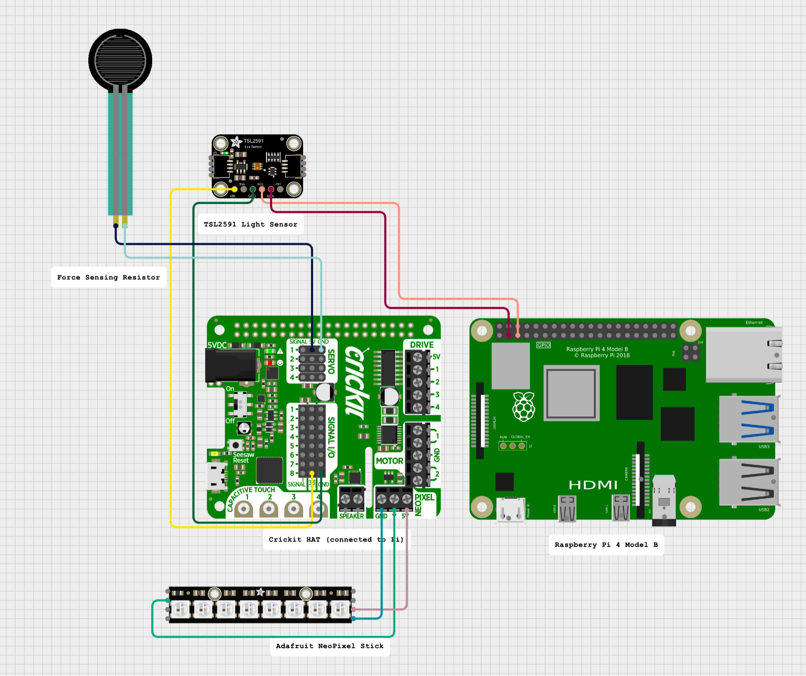

### List of Materials

| Item                                       | Price per Unit | Link                                                                 |
|--------------------------------------------|----------------|----------------------------------------------------------------------|
| Raspberry Pi 4 Model B                     | N/A (Owned)     | [Link](https://www.raspberrypi.com/products/raspberry-pi-4-model-b/) |
| Adafruit Crickit HAT for Raspberry Pi      | N/A (Owned)     | [Link](https://www.adafruit.com/product/3957)                        |
| TSL2591 High Dynamic Range Light Sensor    | $5.95           | [Link](https://www.adafruit.com/product/1980)                        |
| Pressure Sensor (e.g. FSR 402)             | $7.95           | [Link](https://www.adafruit.com/product/166)                         |
| Adafruit I2S MEMS Microphone + Speaker     | $14.95          | [Link](https://www.adafruit.com/product/3369)                        |
| Adafruit NeoPixel Stick (Warm White) × 2   | $7.95 each      | [Link](https://www.adafruit.com/product/2867)                        |


### Circuit Diagram



This diagram shows the connection of the Raspberry Pi 4, Crickit HAT, light sensor (TSL2591), pressure sensor (FSR), microphone/speaker combo, and NeoPixel stick.


### Stepper Motor Hello World Extension

This project extends the original `run_stepper.py` motor control code from class by allowing the stepper motor to be triggered remotely via an HTTP POST request.

A Flask server runs on the Raspberry Pi and listens on `/trigger`. When a request with `{ "move": true }` is received, the motor moves forward and backward by 50 steps each.

This simulates responding to a real-time event such as a web hook or button press from another device or service.

**Example Request:**
```bash
curl -X POST http://<pi-ip>:5000/trigger -H "Content-Type: application/json" -d '{"move": true}'
